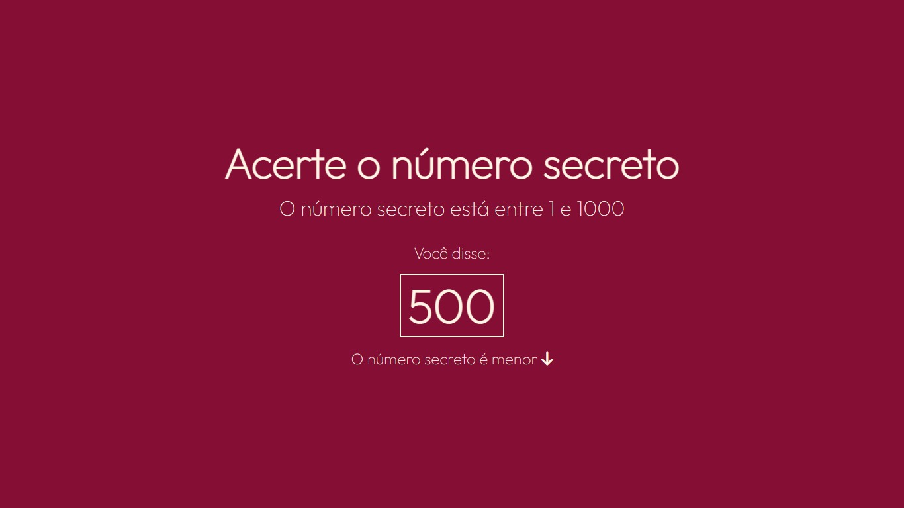

# Adivinhacao
Projeto feito a partir de curso da formação JavaScript da Alura.

  
# Adivinhacao

Jogo criado em JavaScript, utilizando API de reconhecimento de voz, em que o programa sorteia um número e o usuário deve tentar acertá-lo a partir da fala. Projeto feito a partir de curso da Formação JavaScript

## 🔨 Funcionalidades do projeto

Jogo criado em JavaScript, utilizando API de reconhecimento de voz, em que o programa sorteia um número e o usuário deve tentar acertá-lo a partir da fala. Projeto feito a partir de curso da Formação JavaScript

## ✔️ Técnicas e tecnologias utilizadas

- `Funcionalidade 1`: HTML. Linguagem de marcação..
- `Funcionalidade 2`: CSS. Linguagem para estilização do html.
- `Funcionalidade 3`: Javascript. Linguagem de programação.

## 📁 Acesso ao projeto

[Clique aqui para acessar](https://mochila-de-viagem-rho-lyart.vercel.app/)

## 🛠️ Abrir e rodar o projeto

Para abrir e rodar o projeto basta clicar nos ícones de navegação.

## 📚 Mais informações do curso

Mais um projeto realizado a partir da trilha frontend da alura. Recomendo de olhos fechados a plataforma, que está me fazendo evoluir de maneira meteórica.
